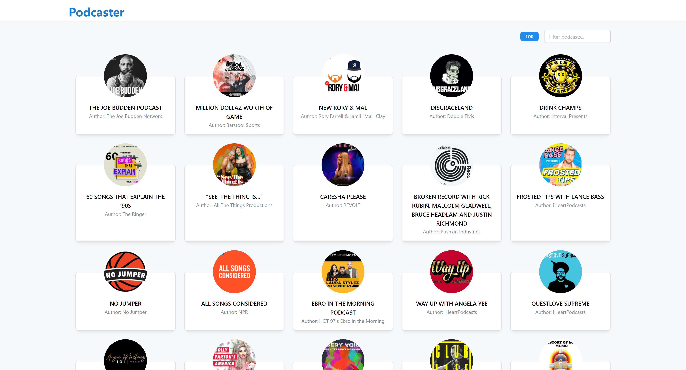
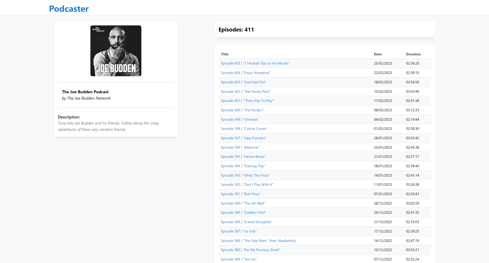
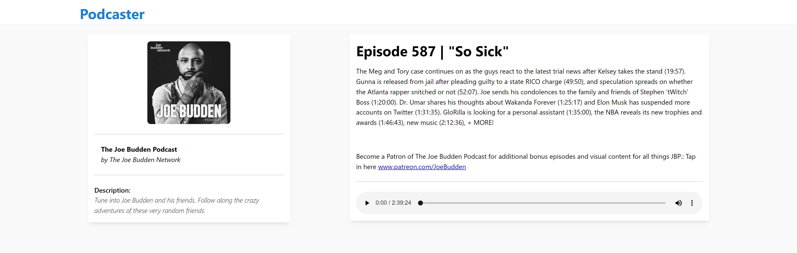

# ZARA.com Front-end Test

Application for listening to music podcasts for the ZARA.com Front-end coding challenge made by David Caro Gallego.

## Installation

The project has been developed with NodeJS v18.14.0

Use any node package manager to install the necessary dependencies.

```bash
pnpm install
# or
yarn install
# or
npm install
```

## Scripts

Run the application in development mode

```bash
pnpm run dev
```

Generate a production build

```bash
pnpm run build
```

Locally preview the production build

```bash
pnpm run preview
```

## Coding challenge Requirements

The test consists of an app for listening to music podcasts. The application should have three screens:

- **Main screen**: It should show the list of the top 100 best music podcasts in iTunes and allow searching by title and author.
- **Podcast details screen**: It should show all the information about the podcast and the list of episodes.
- **Episode details screen**: It should show the episode information and an audio player to listen to it.

It should also have a header that allows navigating to the main screen and shows an indicator if the information is loading.

In addition, all requested information must be stored in the client for 24 hours and will only be requested again if this time has passed since the previous time.

## Dependencies

- [Vite](https://vitejs.dev) used to generate the initial structure of the project.
- [Mantine UI](https://mantine.dev) as components library.
- [Wouter](https://github.com/molefrog/wouter) to manage the different routes of the application.
- [Tanstack Query](https://tanstack.com/query) + [Ky](https://www.npmjs.com/package/ky) to make the necessary API calls, manage their state and store the information received in the client for 24 hours.
- [Fuse](https://fusejs.io/) for fuzzy searching of podcasts by name and author.

## Result



